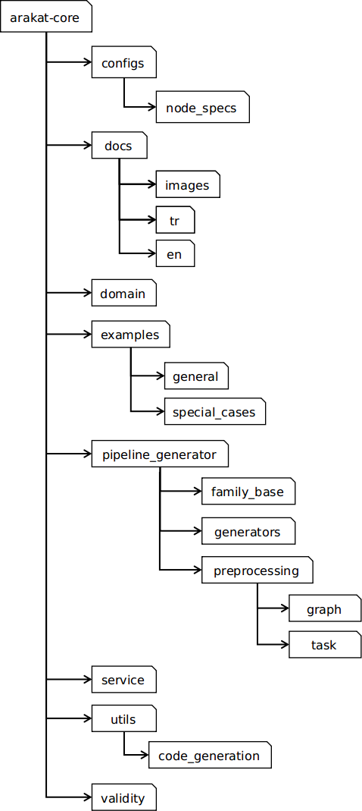

## Temel Yapı

Arakat-Core Temel Yapı Şablonu

Arakat-Core'unun yapı bileşenleri şunlardır:

**configs**

Bu pakette, mevcut nodları ifade node-spec'ler (node özelliklerini ifade eden json'lar) ile nod aileleri ve kategorilerine ait bilgiler yer almaktadır.

Node-spec'ler oluşturulurken kullanılan DSL, core modülde olduğu gibi UI vb. modüller altında da kullanılmaktadır. İleriki versiyonlarda, bu pakette yer alan node-spec'ler bir üst seviyeye taşınabilirler. Bununla birlikte, nod aileleri ve kategorilerine dair bilgiler de bir üst seviyeye taşınabilirler. Böylelikle, modüllerin farkında olması gereken arayüz bilgisi herhangi bir modülün içinde değil de modüller üstü bir seviyede tutulmuş olur.

**docs**

Arakat-core'una ait dokümantasyonu içerir.

**domain**

Bu paket, domain'e ait hata türleri, nod ailesi türleri, özel durum türleri, nodların sahip olduğu üst seviye türleri, içerme bilgileri (hangi nodun hangi *import*'lara ihtiyaç duyduğu), paylaşılan fonksiyon türleri ile bu domain bilgilerini kullanan yardımcı fonksiyonları içerir.

Yardımcı fonksiyonlar dışındaki paket elemanları *enum*'lar şeklindedir. Proje içerisinde kullanılan *constant*'ların *enum*'lar halinde ifade edilmesi, kullanımı ve kontrolü kolaylaştırmaktadır.

**examples**

Bu paket, örnek işlem akışlarına ayrılmıştır. Temel nod ailelerinin kullanımına yönelik örnekler ile ileri seviye nod ailelerini ve uç durumları kapsayan örnekler bu paket içerisinde sunulmuştur.

**pipeline_generator**

Bu paket, nod ailelerini, işlem akışı graph'ının ve task'larının önişlenmesini, işlem akışı (tasklar ve takvimleme için) oluşturulmasını sağlayan işlevleri içermektedir.

**service**

Bu paket, Arakat-core modülünün servis edilmesini sağlayan servisi içermektedir.

**utils**

Bu pakette, gerek kod üretimi gerekse genel işlevler için yardımcı görevindeki fonksiyoneliteler yer almaktadır.

Kod üretimi sırasında parametrelerin işlenmesi, özel durumların ele alınması gibi işlevlere tüm nod aileleri tarafından ihtiyaç duyulmaktadır. Bu işlevler, *utils* altında toplanmıştır.

**validity**

İşlem akışlarını ifade eden graph'ın anlamlandırılması sürecinde kontrol edilmesi gereken durumları ele alan işlevler bu paket altında sağlanmaktadır. Bu kontroller, nodlara giren bağlantıların kontrol edilmesi gibi tüm nodları kapsayan kontroller olabileceği gibi spesifik nodlara (cross-validation nodu, pipeline nodu, data-sourse nodları vb.) veya işlevlere ait kontrolleri de içerebilir.