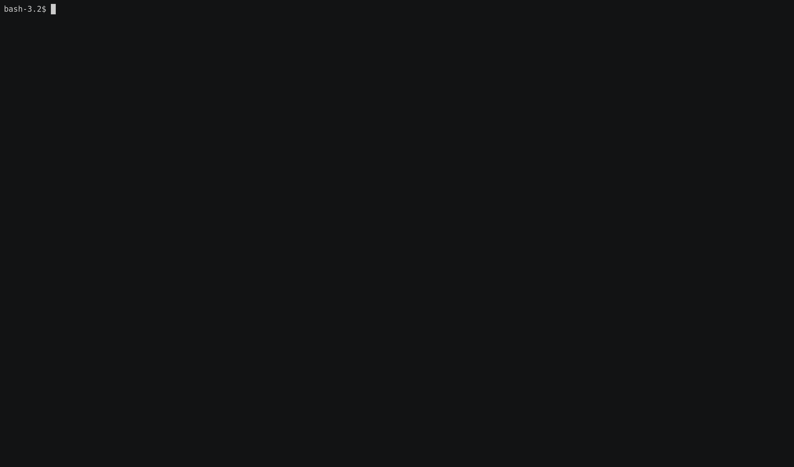

# ARAKAT Java Servisi

## İçerik
* Java web uygulamasını geliştirmek için [Spring Boot](https://spring.io/projects/spring-boot) kullanılmıştır.
* Bağımlılık yöneticisi olarak [Maven](https://maven.apache.org/) kullanılmıştır.
* Uygulama Programlama Arayüzü(API) tanımlamak amacıyla [Swagger2.0](https://swagger.io/docs/specification/2-0/basic-structure/) kullanılmıştır.
* [arakat-core](../arakat-core) tarafındaki _node_spec_'leri, _family_'leri ve _category_'leri tutmak için [MongoDB](https://www.mongodb.com/) kullanılmıştır.
* [arakat-frontend](../arakat-frontend) tarafındaki grafik ve tablolara veri sağlamak amacı ile [HDFS](https://hadoop.apache.org/docs/r1.2.1/hdfs_design.html) kullanılmıştır.

## Geliştirme Ortamında Çalıştırmak

### **Docker Kullanmadan Çalıştırmak**
### Ön Gereksinimler
* JDK _1.8 veya daha güncel bir versiyonu_
* Maven _3 veya daha güncel bir versiyonu_
* MongoDB _3.2.21 veya daha güncel bir versiyonu_

#### Çalıştırma
Uygulamayı geliştirme ortamında çalıştırmak için terminalinizde projenin en üst dizininde aşağıdaki komutu çalıştırmanız gerekmektedir:

``
$ SPRING_PROFILES_ACTIVE=development mvn spring-boot:run
``

### **Docker Kullanarak Çalıştırmak**
#### Ön Gereksinimler

* Docker _18.06.1-ce veya daha güncel bir versiyonu_

#### Kaynak Koddan Docker İmajı Oluşturmak

arakat-backend'in Docker imajını lokal geliştirme ortamınızda oluşturmak için terminalinizde projenin en üst dizininde aşağıdaki komutu çalıştırmanız gerekmektedir: (Docker imajının etiketini latest yapmak için etiket kısmını boş bırakabilirsiniz.)

``
$ docker build -t arakat-backend:<SİZİN ETİKETİNİZ> .
``
#### Lokalinizde Oluşturduğunuz Docker İmajını Çalıştırmak

arakat-backend'in Docker imajını lokal geliştirme ortamınızda çalıştırmak için terminalinizde aşağıdaki komutu çalıştırmanız gerekmektedir:

``
$ docker run -d -p 8080:8080 arakat-backend:<SİZİN ETİKETİNİZ>
``

#### Docker İmajını Docker Hub'dan Çekerek Çalıştırmak

arakat-backend'in Docker imajını Docker Hub'dan çekmek için terminalinizde aşağıdaki komutu çalıştırmanız gerekmektedir: (Docker imajının etiketini latest olarak kullanmak için etiket kısmını boş bırakabilirsiniz.)

``
$ docker pull arakat/arakat-backend:<ETİKET>
``

``
$ docker run -d -p 8080:8080 arakat-backend:<ETİKET>
``

#### Swagger Arayüzü

Uygulamayı çalıştırdıktan sonra Swagger arayüzüne erişmek için

``
http://localhost:8080/arakat-java-service/swagger-ui.html
``
adresini ziyaret edebilirsiniz.

#### Sorun Giderme / Yeni Özellik İsteği

Arakat ile ilgili bir sorunuz olduğunda, bir bug bulduğunuzda ya da yeni bir özellik isteğinde bulunmak istediğinizde [GitHub/Issues](https://github.com/arakat-community/arakat/issues) sekmesini kullanabilirsiniz.
